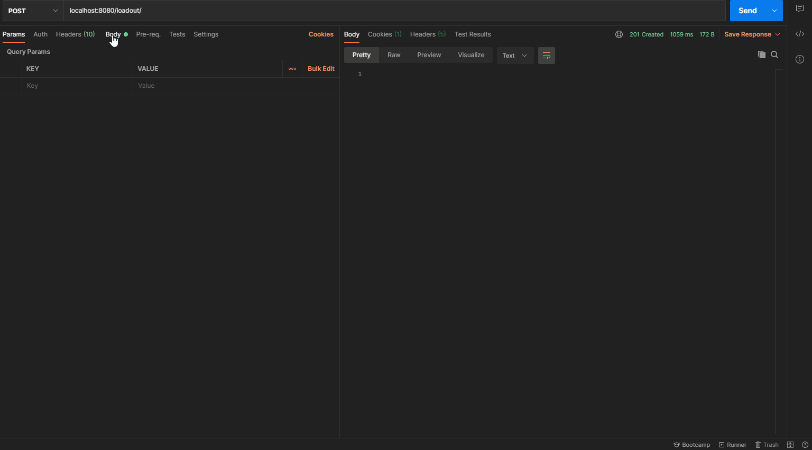

# Call Of Duty Mobile Companinon Service

This API Stores [**CODM**](https://www.callofduty.com/mobile) Weapons (Loadout) Shared by Player all over the world.

In Future this API would be able to be integrated with any Discord BOT (Development in Progress..)

# Whats Working ??

Currently, this API can Upload Image to Database and Fetch the particular image from DB.

 - To Upload the Image (Loadout)
    
    
    Make POST Request to URL `localhost:8080/loadout/` also add image as multipart/form-data with name attribute as `file`.
    
    
    On Success API will return status code `201 Created`, the Location can also be found in the Response Header.
    
    
    
    
    
 - To Download the Image (Loadout)
        
    Make GET Request to URL `localhost:8080/loadout/<image_location>`, On Success image will be returned with Status CODE `200 OK`
    
    
   